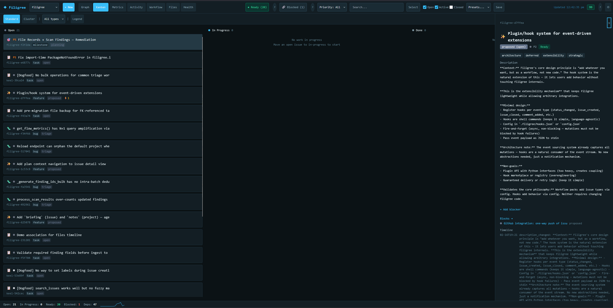

# Filigree

Local-first issue tracker designed for AI coding agents — SQLite, MCP tools, no cloud, no accounts.

[](https://github.com/tachyon-beep/filigree/actions/workflows/ci.yml)
[](https://pypi.org/project/filigree/)
[](https://pypi.org/project/filigree/)
[](https://github.com/tachyon-beep/filigree/blob/main/LICENSE)



## What Is Filigree?

Filigree is a lightweight, SQLite-backed issue tracker designed for AI coding agents (Claude Code, Codex, etc.) to use as first-class citizens. It exposes 53 MCP tools so agents interact natively, plus a full CLI for humans and background subagents.

Traditional issue trackers are human-first — agents scrape CLI output or parse API responses. Filigree flips this: agents get a pre-computed `context.md` at session start, claim work with optimistic locking, and resume sessions via event streams without re-reading history. For Claude Code, `filigree install` wires up session hooks and a workflow skill pack so agents get project context automatically.

Filigree is local-first. No cloud, no accounts. Each project gets a `.filigree/` directory (like `.git/`) containing a SQLite database, configuration, and auto-generated context summary. Installations support two modes: `ethereal` (default, per-project) and `server` (persistent multi-project daemon).

### Key Features

- **MCP server** with 53 tools — agents interact natively without parsing text
- **Full CLI** with `--json` output for background subagents and `--actor` for audit trails
- **Claude Code integration** — session hooks inject project snapshots at startup; bundled skill pack teaches agents workflow patterns
- **Workflow templates** — 24 issue types across 9 packs with enforced state machines
- **Dependency graph** — blockers, ready-queue, critical path analysis
- **Hierarchical planning** — milestone/phase/step hierarchies with automatic unblocking
- **Atomic claiming** — optimistic locking prevents double-work in multi-agent scenarios
- **Pre-computed context** — `context.md` regenerated on every mutation for instant agent orientation
- **Web dashboard** — real-time project overview with Kanban drag-and-drop, Graph v2 dependency exploration, Files/Health views, and optional multi-project server mode
- **Minimal dependencies** — just Python + SQLite + click (no framework overhead)
- **Session resumption** — `get_changes --since <timestamp>` to catch up after downtime

## Quick Start

```bash
pip install filigree        # or: uv add filigree
cd my-project
filigree init               # Create .filigree/ directory
filigree install             # Set up MCP, hooks, skills, CLAUDE.md, .gitignore
filigree create "Set up CI pipeline" --type=task --priority=1
filigree ready               # See what's ready to work on
filigree update <id> --status=in_progress
filigree close <id>
```

## Installation

```bash
pip install filigree                     # Core CLI
pip install "filigree[mcp]"              # + MCP server
pip install "filigree[dashboard]"        # + Web dashboard
pip install "filigree[all]"              # Everything
```

Or from source:

```bash
git clone https://github.com/tachyon-beep/filigree.git
cd filigree && uv sync
```

### Entry Points

| Command | Purpose |
|---------|---------|
| `filigree` | CLI interface |
| `filigree-mcp` | MCP server (stdio transport) |
| `filigree-dashboard` | Web UI (port 8377) |

### Claude Code Setup

`filigree install` configures everything in one step. To install individual components:

```bash
filigree install --claude-code   # MCP server + CLAUDE.md instructions
filigree install --hooks         # SessionStart hooks (project snapshot + dashboard auto-start)
filigree install --skills        # Workflow skill pack for agents
filigree doctor                  # Verify installation health
```

The session hook runs `filigree session-context` at startup, giving the agent a snapshot of in-progress work, ready tasks, and the critical path. The skill pack (`filigree-workflow`) teaches agents triage patterns, team coordination, and sprint planning step by step.

## Why Filigree?

Filigree is designed for a specific niche: local-first, agent-driven development. It is not a replacement for GitHub Issues or Jira.

| Feature | Filigree | GitHub Issues | Jira |
|---------|----------|---------------|------|
| Agent-native MCP tools | Yes | No | No |
| Works offline, no account needed | Yes | No | No |
| Enforced workflow state machines | Yes | Limited | Yes |
| Dependency graph + critical path | Yes | Limited | Yes |
| Structured queries and filtering | Yes | Yes | Yes |
| Multi-user cloud collaboration | No | Yes | Yes |
| Integration ecosystem (CI, Slack) | No | Yes | Yes |

## When NOT to Use Filigree

Filigree is designed for one niche well. It is the wrong tool if you need:

**Team collaboration across machines.**
Filigree has no cloud sync, no accounts, and no network-accessible API beyond localhost. If your team of humans needs to file bugs, assign tickets, and comment across different machines, use GitHub Issues, Linear, or Jira.

**Integration with your existing toolchain.**
Filigree does not connect to CI pipelines, Slack, PagerDuty, or third-party services. If your workflow requires automated ticket creation from alerts or Slack-based triage, Filigree will not fit without custom scripting.

**A persistent project record outlasting the repository.**
Your `.filigree/` directory lives with your project. If you need an audit trail that survives repository deletion or is accessible after the project ends, use a hosted service.

**Multi-project portfolio management.**
The web dashboard supports switching between local projects, but Filigree has no cross-project reporting, resource allocation, or roadmap views. It tracks tasks, not portfolios.

**Mobile or browser-based access.**
The dashboard runs on localhost. If stakeholders need to read or file issues from their phone or a machine where the project is not checked out, Filigree is not the right choice.

**The sweet spot**: one developer or agent team, one project, offline or airgapped, where you want structured workflow enforcement and agent-native tooling without standing up external infrastructure.

## Documentation

| Document | Description |
|----------|-------------|
| [Getting Started](docs/getting-started.md) | 5-minute tutorial: install, init, first issue |
| [CLI Reference](docs/cli.md) | All CLI commands with full parameter docs |
| [MCP Server Reference](docs/mcp.md) | 53 MCP tools for agent-native interaction |
| [Workflow Templates](docs/workflows.md) | State machines, packs, field schemas, enforcement |
| [Agent Integration](docs/agent-integration.md) | Multi-agent patterns, claiming, session resumption |
| [Python API Reference](docs/api-reference.md) | FiligreeDB, Issue, TemplateRegistry for programmatic use |
| [Architecture](docs/architecture.md) | Source layout, DB schema, design decisions |
| [Examples](docs/examples/) | Runnable scripts: multi-agent, workflows, CLI scripting, planning |

## Priority Scale

| Priority | Label | Meaning |
|----------|-------|---------|
| P0 | Critical | Drop everything |
| P1 | High | Do next |
| P2 | Medium | Default |
| P3 | Low | When possible |
| P4 | Backlog | Future consideration |

Full definitions: [Workflow Templates — Priority Scale](docs/workflows.md#priority-scale)

## Development

Requires Python 3.11+. Developed on 3.13.

```bash
git clone https://github.com/tachyon-beep/filigree.git
cd filigree
uv sync --group dev

make ci              # ruff check + mypy strict + pytest with 85% coverage gate
make lint            # Ruff check + format check
make format          # Auto-format with ruff
make typecheck       # Mypy strict mode
make test            # Pytest
make test-cov        # Pytest with coverage (fail-under=85%)
```

### Key Conventions

- **Ruff** for linting and formatting (line-length=120)
- **Mypy** in strict mode
- **Pytest** with pytest-asyncio for MCP server tests
- **Coverage** threshold at 85%
- Tests in `tests/`, source in `src/filigree/`

## Acknowledgements

Filigree was inspired by Steve Yegge's [beads](https://github.com/steveyegge/beads) project. Filigree builds on the core idea of git-friendly issue tracking, focusing on MCP-native workflows and local-first operation.

## License

[MIT](LICENSE) — Copyright (c) 2026 John Morrissey
